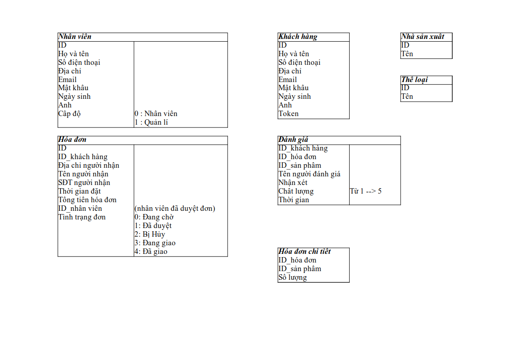

# Đồ Án 1
*Một dự án về web bán hàng rất là cơ bản*

## BÁN HÀNG ĐIỆN TỬ
*Chú ý*
>Mọi tài liệu thông tin đều được lưu vào thư mục "Document"
### 1. Đối tương sử dụng:
***Khác hàng không tài khoản***

>+ Tìm kiếm theo tên sản phẩm
>+ Xem tất cả, chi tiết sản phẩm
>+ Đăng ký

***Khách hàng có tài khoản:***

>+ Tất cả chức năng của không tài khoản
>+ Đăng nhập, đăng xuất
>+ Quản lí giỏ hàng(thêm, sửa số lượng, xóa) (dùng Session)
>+ Đặt hàng, xem hóa đơn
>+ Đánh giá sản phẩm đã mua.

***Nhân viên***

>+ Đăng nhập, đăng xuất
>+ Thêm sản phẩm
>+ Thay đổi tình trạng đơn (Đang chờ - Đã duyệt – Đang giao – Đã giao ) 

***Quản lý***

>+ Đầy đủ của nhân viên
>+ Quản lý nhà sản xuất(xem, thêm, sửa)
>+ Quản lý sản phẩm(xem, thêm, sửa, xóa)
>+ Quản lý nhân viên(xem, thêm , sửa, xóa)

### 2. Quan hệ thực thể

### 3. Bảng Database 

  